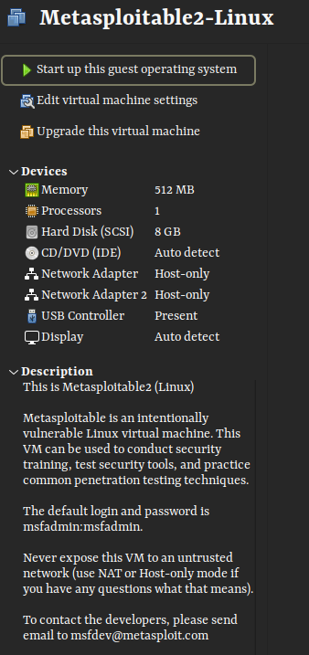
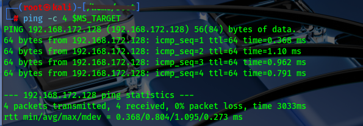
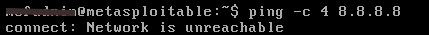
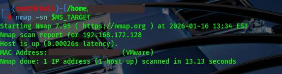
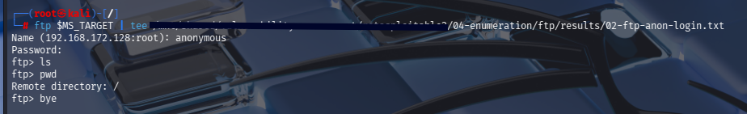
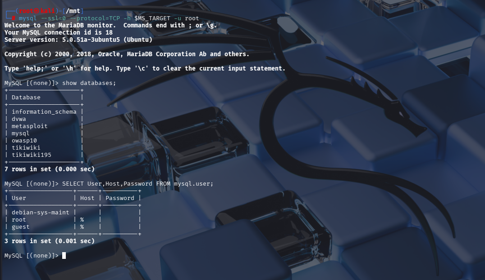
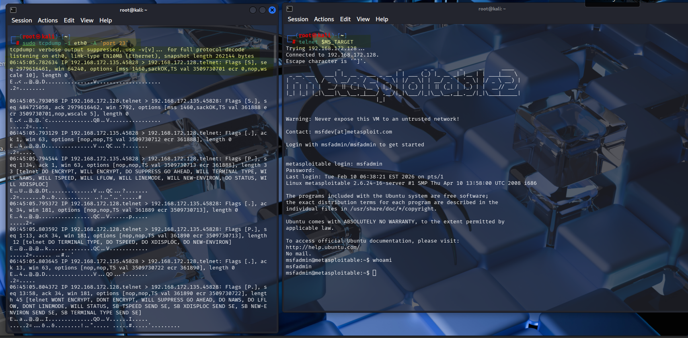
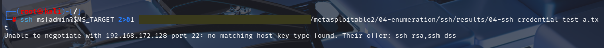
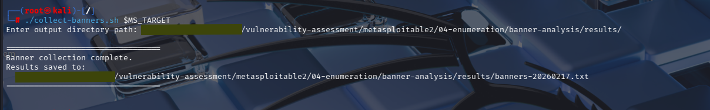

# Metasploitable2 — Manual Enumeration & Vulnerability Assessment

> **Type:** Penetration Testing Lab Documentation  
> **Target:** Metasploitable2  
> **Environment:** Isolated Host-Only Lab Network  
> **Methodology:** Manual Enumeration (No Automated Exploitation Frameworks)

---

## Table of Contents

1. [Overview](#1-overview)
2. [Lab Environment](#2-lab-environment)
3. [Repository Structure](#3-repository-structure)
4. [Phases Covered](#4-phases-covered)
5. [Services Enumerated](#5-services-enumerated)
6. [Key Findings Summary](#6-key-findings-summary)
7. [Reports](#7-reports)
8. [Resources & Methodology](#8-resources--methodology)
9. [Legal Disclaimer](#9-legal-disclaimer)

---

## 1. Overview

This repository contains the complete documentation, evidence, and reporting artefacts for a **manual enumeration and vulnerability assessment** conducted against **Metasploitable2** — an intentionally vulnerable Linux virtual machine designed for security training and practice.

The objective of this engagement was to methodically enumerate every exposed service using manual techniques, collect raw evidence, and produce structured technical reports for each attack surface — without relying on automated exploitation frameworks for the primary enumeration work.

| Field | Details |
|---|---|
| **Target** | Metasploitable2 |
| **Attacker** | Kali Linux (`kali`) |
| **Network Type** | VMware Host-Only (Isolated) |
| **Approach** | Manual Enumeration |
| **Prepared By** | Wilson Njoroge Wanderi |
| **Last Updated** | 26th April 2026 |

---

## 2. Lab Environment

```
Attacker : Kali Linux (hostname: kali) — 192.168.172.137
Target   : Metasploitable2              — 192.168.172.128
Network  : VMware Host-Only (isolated, no internet access)
```

### VM Configuration



*Metasploitable2 VM configured on an isolated Host-Only network adapter in VMware.*

### Attacker → Target Reachability



*ICMP reachability confirmed from Kali (`kali`) to Metasploitable2 before testing commenced.*

### Network Isolation Verification



*Outbound internet access confirmed blocked — target is fully isolated within the lab network.*

Before any testing commenced, the lab network was verified to be fully isolated from external networks. Full evidence is documented in `01-pre-engagement/`:

- Network interface verification
- Routing table check
- ICMP-based isolation confirmation (no external reachability from target)

> ⚠️ **All activity was conducted in a fully isolated, offline lab environment against an intentionally vulnerable machine. No real systems were targeted.**

---

## 3. Repository Structure

```
.
├── 01-pre-engagement/          # Environment setup & isolation verification
│   ├── evidence/               # Screenshots confirming lab configuration
│   ├── isolation-verification/
│   ├── network-interface-verification/
│   └── routing-table-check/
│
├── 02-reconnaissance/          # Host discovery & OS fingerprinting
│   ├── evidence/
│   ├── host-discovery/
│   └── os-fingerprinting/
│
├── 03-enumeration/             # Service-by-service manual enumeration
│   ├── banner-analysis/        # Banner collection across all services
│   ├── credential-testing/     # Default/common credential testing
│   ├── database/               # MySQL & PostgreSQL enumeration
│   ├── dns/                    # DNS version, recursion & zone testing
│   ├── ftp/                    # FTP banner, anonymous login, version
│   ├── java-rmi/               # Java RMI version & registry dump
│   ├── rpc-nfs/                # RPC service enumeration & NFS exports
│   ├── smtp/                   # SMTP version, user enumeration, open relay
│   ├── ssh/                    # SSH version, algorithms, auth methods
│   ├── telnet/                 # Telnet banner grab & traffic capture
│   ├── tomcat/                 # Tomcat service, web & manager enumeration
│   ├── web-enumeration/        # Directory brute-force, tech fingerprinting
│   └── x11/                   # X11 service detection & access test
│
├── 04-reporting/               # Full technical reports per service
│   ├── metasploitable2-full-technical-report.md  # Master report — all findings
│   ├── ftp-report.md
│   ├── ssh-report.md
│   ├── telnet-report.md
│   ├── smtp-report.md
│   ├── dns-report.md
│   ├── web-enumeration-report.md
│   ├── database-enumeration-report.md
│   ├── tomcat-report.md
│   ├── rpc-nfc-report.md
│   ├── java-rmi-report.md
│   ├── x11-report.md
│   ├── banner-collection-report.md
│   └── credential-reuse--testing-report.md
└── resources/                  # Methodology references
```


Each enumeration subfolder follows a consistent layout:

```
<service>/
├── results/        # Raw tool output (.txt, .nmap, .xml, .gnmap, .pcap, .log)
└── screenshots/    # Terminal screenshots evidencing each step
```

---

## 4. Phases Covered

| Phase | Directory | Description |
|---|---|---|
| Pre-Engagement | `01-pre-engagement/` | Lab setup, network isolation, environment verification |
| Reconnaissance | `02-reconnaissance/` | Host discovery, OS fingerprinting via Nmap |
| Enumeration | `04-enumeration/` | Deep manual enumeration of all exposed services |
| Reporting | `05-reporting/` | Per-service technical reports + full assessment report |

### Host Discovery


*Nmap host discovery confirming Metasploitable2 is live on the isolated network before enumeration began.*

---

## 5. Services Enumerated

| # | Service | Port(s) | Tools Used |
|---|---|---|---|
| 1 | FTP | 21, 2121 | `ftp`, `nmap`, netcat |
| 2 | SSH | 22 | `ssh`, `nmap -sV` |
| 3 | Telnet | 23 | `telnet`, Wireshark |
| 4 | SMTP | 25 | `telnet`, `smtp-user-enum` |
| 5 | DNS | 53 | `dig`, `nmap` NSE scripts |
| 6 | HTTP / Web | 80 | `dirb`, `gobuster`, `curl`, `whatweb` |
| 7 | RPC / NFS | 111, 2049 | `rpcinfo`, `showmount`, `nmap` |
| 8 | Java RMI | 1099 | `nmap` NSE scripts |
| 9 | MySQL | 3306 | `mysql` client |
| 10 | PostgreSQL | 5432 | `psql` client |
| 11 | VNC | 5900 | `nmap` |
| 12 | X11 | 6000 | `nmap`, `xdpyinfo` |
| 13 | IRC (UnrealIRCd) | 6667 | `nmap`, netcat |
| 14 | Apache Tomcat | 8180 | `nmap`, `curl`, `dirb` |
| 15 | Banners (all) | Various | Custom `collect-banners.sh` |
| 16 | Credential Testing | Various | Manual per-service testing |

---

## 6. Key Findings Summary

| Severity | # | Finding |
|---|---|---|
| 🔴 Critical | 1 | vsftpd 2.3.4 — backdoor command execution (CVE-2011-2523) |
| 🔴 Critical | 2 | Bindshell on port 1524 — unauthenticated root shell exposed |
| 🔴 Critical | 3 | UnrealIRCd — backdoor remote code execution (CVE-2010-2075) |
| 🔴 Critical | 4 | rexec / rlogin / rsh (512–514) — no encryption, no authentication |
| 🔴 Critical | 5 | MySQL root account — no password, anonymous access |
| 🟠 High | 6 | Telnet — cleartext credential transmission |
| 🟠 High | 7 | VNC Protocol 3.3 — weak authentication |
| 🟠 High | 8 | Apache Tomcat — default credentials (`tomcat:tomcat`) |
| 🟠 High | 9 | Samba — potentially exploitable SMB service |
| 🟡 Medium | 10 | NFS — world-readable exports possible |
| 🟡 Medium | 11 | SMTP — open relay and user enumeration possible |
| 🟡 Medium | 12 | DNS — recursive queries permitted externally |
| 🔵 Info | 13 | X11 — display server accessible without authentication |
| 🔵 Info | 14 | Java RMI registry — remotely accessible |

> Full per-service vulnerability details are documented in `05-reporting/`.

### Evidence Highlights

The screenshots below are representative evidence from `04-enumeration/`, illustrating the most impactful findings across the attack surface.

**FTP — Anonymous Login (Port 21)**


*Anonymous FTP login accepted with no credentials — full read access to the FTP share confirmed.*

---

**MySQL — Root Access, No Password (Port 3306)**


*MySQL root account accessible with no password — full database access without authentication.*

---

**Telnet — Cleartext Traffic Capture (Port 23)**


*Wireshark capture of a Telnet session — credentials and session data transmitted in cleartext across the network.*

---

**SSH — Credential Testing**


*SSH credential reuse testing against Metasploitable2 — confirming weak default account access.*

---

**Banner Analysis — All Services**


*Custom `collect-banners.sh` script harvesting service banners across all open ports in a single pass.*

---

## 7. Reports

All reports are located in `04-reporting/` and follow the same structured format used throughout this documentation.

| Report | Description |
|---|---|
| [`metasploitable2-full-technical-report.md`](./04-reporting/metasploitable2-full-technical-report.md) | Master report covering all findings across all services |
| [`ftp-report.md`](./04-reporting/ftp-report.md) | FTP enumeration — vsftpd backdoor, anonymous login |
| [`ssh-report.md`](./04-reporting/ssh-report.md) | SSH version, weak algorithms, credential testing |
| [`telnet-report.md`](./04-reporting/telnet-report.md) | Telnet cleartext transmission, traffic capture |
| [`smtp-report.md`](./04-reporting/smtp-report.md) | SMTP user enumeration, open relay testing |
| [`dns-report.md`](./04-reporting/dns-report.md) | DNS version disclosure, recursion, zone testing |
| [`web-enumeration-report.md`](./04-reporting/web-enumeration-report.md) | Directory brute-force, tech fingerprinting, exposed paths |
| [`database-enumeration-report.md`](./04-reporting/database-enumeration-report.md) | MySQL & PostgreSQL unauthenticated access |
| [`tomcat-report.md`](./04-reporting/tomcat-report.md) | Tomcat manager interface, default credentials |
| [`rpc-nfc-report.md`](./04-reporting/rpc-nfc-report.md) | RPC services, NFS export enumeration |
| [`java-rmi-report.md`](./04-reporting/java-rmi-report.md) | Java RMI registry dump |
| [`x11-report.md`](./04-reporting/x11-report.md) | X11 service detection and access test |
| [`banner-collection-report.md`](./04-reporting/banner-collection-report.md) | Aggregated banner analysis across all services |
| [`credential-reuse--testing-report.md`](./04-reporting/credential-reuse--testing-report.md) | Credential reuse testing across SSH, FTP, Telnet, MySQL, PostgreSQL |

---

## 8. Resources & Methodology

The following methodology documents guided this engagement and are available in the `resources/` directory:

| Document | Description |
|---|---|
| [`metasploitable2-methodology-v1.md`](./resources/metasploitable2-methodology-v1.md) | Step-by-step enumeration methodology for Metasploitable2 |
| [`dvwa-methodology-v1.md`](./resources/dvwa-methodology-v1.md) | Methodology reference for DVWA (Damn Vulnerable Web Application) |

---

## 9. Next Steps

The engagement now progresses into three remaining phases: 
* Exploitation for validation
* Post-exploitation analysis
* Remediation verification.  
These will be tracked under new directories that mirror the numbering convention already established.
---

### 9.1 Exploitation & Validation → `06-exploitation/`

The findings in `05-reporting/` identify known-vulnerable versions and confirmed misconfigurations. The next phase proves exploitability by actively weaponising each critical and high-severity finding and capturing the evidence.

| Priority | Target | Vector | Method |
|---|---|---|---|
| 🔴 Critical | vsftpd 2.3.4 | FTP backdoor (port 6200) | `exploit/unix/ftp/vsftpd_234_backdoor` |
| 🔴 Critical | Bindshell port 1524 | Direct unauthenticated root shell | `nc $MS_TARGET 1524` |
| 🔴 Critical | UnrealIRCd | IRC backdoor RCE | `exploit/unix/irc/unreal_ircd_3281_backdoor` |
| 🔴 Critical | rexec / rlogin / rsh | Unauthenticated remote shell | `rsh`, `rlogin` clients |
| 🔴 Critical | MySQL | Root login, no password | `mysql -u root -h $MS_TARGET` |
| 🟠 High | Apache Tomcat | WAR deploy via Manager UI | Default creds `tomcat:tomcat` → WAR upload |
| 🟠 High | VNC | Weak auth bypass | `vncviewer $MS_TARGET` |
| 🟠 High | Samba | SMB exploit / share enumeration | `exploit/multi/samba/usermap_script` |
| 🟠 High | Telnet | Cleartext credential capture | Live traffic capture via Wireshark |
| 🟡 Medium | NFS | Mount world-readable export | `mount -t nfs $MS_TARGET:/ /mnt/nfs` |

Evidence (session logs, screenshots, captured shells) will be saved under `06-exploitation/`, following the same `results/` + `screenshots/` layout used in `04-enumeration/`.

---

### 9.2 Post-Exploitation → `07-post-exploitation/`

Once initial access is established, the post-exploitation phase documents what a real attacker could achieve after the initial foothold:

- **Privilege escalation** — confirming root-level access where not already obtained directly (e.g. via bindshell or vsftpd backdoor)
- **Credential harvesting** — extracting `/etc/passwd`, `/etc/shadow`, database credentials, and SSH keys
- **Lateral movement** — pivoting within the lab using harvested credentials across SSH, FTP, Telnet, MySQL, and PostgreSQL
- **Persistence** — documenting persistence mechanisms such as cron jobs, backdoor accounts, and SUID binaries
- **Data exfiltration simulation** — identifying sensitive files accessible post-compromise

---

### 9.3 Remediation & Hardening → `08-remediation/`

Each finding from `05-reporting/` maps to a concrete remediation action. If this were a production system, these fixes would be applied and re-tested:

| Finding | Remediation |
|---|---|
| vsftpd 2.3.4 backdoor | Upgrade to vsftpd ≥ 3.0.5 or replace with SFTP |
| Bindshell on port 1524 | Disable service immediately; audit for similar listeners |
| UnrealIRCd backdoor | Remove or upgrade to a verified clean build |
| rexec / rlogin / rsh | Disable `inetd` entries; enforce SSH only |
| MySQL no-password root | Set a strong root password; disable remote root login |
| Telnet | Disable `telnetd`; replace with SSH |
| VNC Protocol 3.3 | Upgrade to VNC with NLA or tunnel via SSH |
| Tomcat default credentials | Rotate credentials; restrict Manager UI to localhost |
| Samba | Audit `smb.conf`; enforce SMB signing; restrict shares |
| NFS world-readable exports | Restrict `/etc/exports` to specific trusted hosts |
| SMTP open relay | Configure `smtpd_recipient_restrictions` in Postfix |
| DNS unrestricted recursion | Restrict recursion to internal resolvers only |

---

### 9.4 Engagement Completion Checklist

| Status | Task |
|---|---|
| ✅ | Pre-engagement — lab isolation verified (`01-pre-engagement/`) |
| ✅ | Reconnaissance — host discovery completed (`02-reconnaissance/`) |
| ⬜ | Scanning — full Nmap scan artefacts (`03-scanning/`) |
| ✅ | Enumeration — all 16 services manually enumerated (`04-enumeration/`) |
| ✅ | Reporting — per-service reports and full technical report (`05-reporting/`) |
| ⬜ | Exploitation — validate critical & high findings (`06-exploitation/`) |
| ⬜ | Post-exploitation — privilege escalation, persistence, lateral movement (`07-post-exploitation/`) |
| ⬜ | Remediation — document fixes and re-test verification (`08-remediation/`) |

---

## 10. Legal Disclaimer

> 📋 **This repository is produced strictly for educational purposes within a controlled, isolated lab environment.**
>
> All testing was performed against **Metasploitable2** — an intentionally vulnerable virtual machine created by Rapid7 for security training. No real-world systems, networks, or individuals were targeted at any point during this engagement.
>
> Reproducing any techniques documented here against systems you do not own or have explicit written permission to test is **illegal and unethical**. The author accepts no liability for misuse of the information contained in this repository.

---

<div align="center">

---

⭐ **If you find this work valuable, please consider starring the repository**

**Prepared By: Wilson Njoroge Wanderi**  
*Last Updated: 26th April 2026*

</div>
